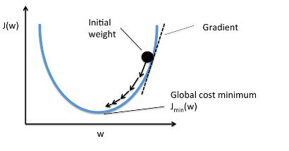
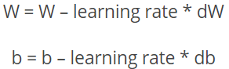
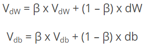
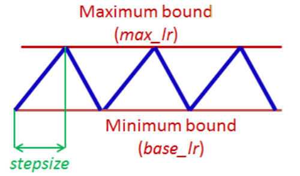
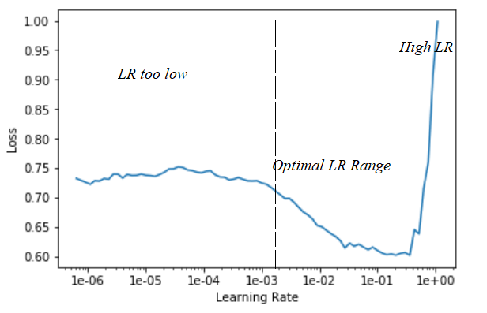
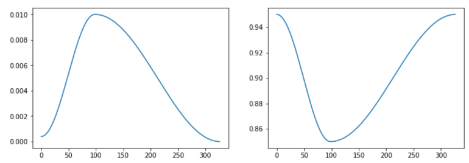
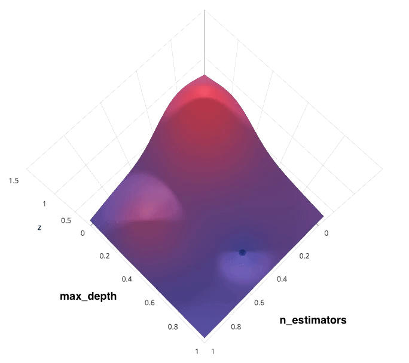
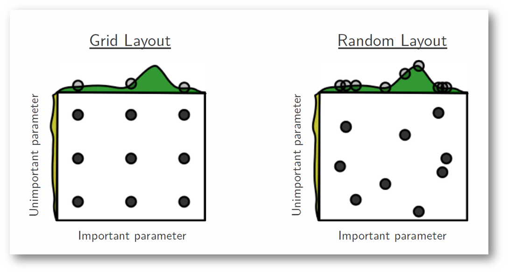
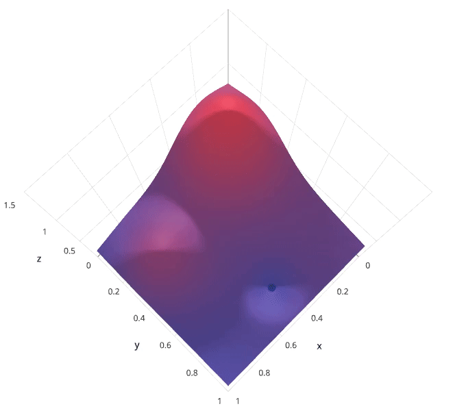
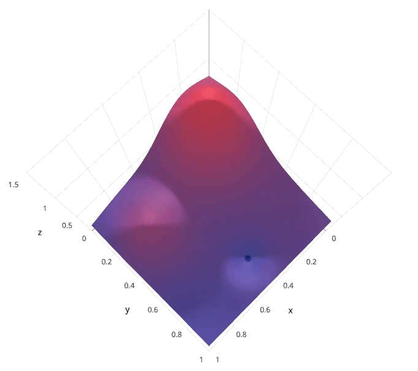

# [A Simple Way to Accelerate Hyperparameter Tuning](https://towardsdatascience.com/accelerate-hyperparameter-tuning-217c95ca626e)
* Bu makale birçok farklı dosyadan veri alınarak oluşturulan modelleri hızlandırmakla alakalı.

# [Hyper-parameter Tuning Techniques in Deep Learning](https://towardsdatascience.com/hyper-parameter-tuning-techniques-in-deep-learning-4dad592c63c8)
* Hiperparametreleri ayarlamak tecrübe işidir ve çaba isteyen bir iştir. Hiperparametreleri ayarlamanın kolay bir yolu yoktur.
* Hiperparametreleri ayarlamanın yollarını tartışmadan önce şu hiperparametreleri anlamalıyız : learning rate, batch size, momentum ve weight decay.

## Gradient Descent Algoritması
* ML algoritmasının temel amacı loss yada cost değerini düşürmek için ağırlıkları(w) ayarlamaktır. Cost değeri, modelin tahminin bir ölçüsüdür. Böylece cost function'un değerini düşürerek en iyi performans gösteren parametreler bulunabilir.
* Gradient descent algoritmasında rastgele model parametrelerinden başlarız ve her bir öğrenme adımında hatayı hesaplarız. Bu işlem minimum hata bulunana kadar devam eder.
* Gradient descent algoritmasında, bir sonraki noktanın bulunması için gradient(eğim) bir sabitle(learning rate) çarpılır.
* Eğer learning rate küçükse, daha sağlam ve daha yavaş olur.
* Eğer learning rate büyükse, eğitim yakınsamayıp sapabilir. Bu durumda loss düşeceğine yükselebilir.
* 
* 
* In momentum, instead of using dw and db independently for each epoch, we take the exponentially weighted averages of dw and db.
* 
   

## En iyi hiperparametreleri bulmak
* Hiper parametreleri optimize etmek için kullanılan 2 geleneksel yöntem vardır. Bunlar grid search ve random search'dür. Random search daha kısa sürer ama grid search belirlenen grid içindeki en iyi parametreyi bulmayı garanti eder.
* Random search, grid search'e göre daha iyi sonuçlar verse de bu iki yaklaşım da hesaplama ve zaman açısından maliyetlidir.2018'de Leslie N. Smith, hiperparametreleri bulmak için kullanılan çeşitli yaklaşımları inceledi. Ve kendisi bir yaklaşım öne sürdü. Bu yaklaşım, optimum parametreleri bulmak için uğraşmak yerine eğitim ve test verisindeki overfitting/underfitting ipuçlarını takip ederek denge noktasını bulmaya dayanmaktadır. 
	Yaklaşımın özeti : Eğitimin erken aşamalarına test hatasına bakarak görünen ipuçlarını gözle ve anla. Modelin mimarisini ve hiperparametrelerini bi kaç epoch'luk periyotlarla güncelle. Eğitimin erken aşamalarındaki underfitting ve overfitting işaretleri hiperparametreleri ayarlamak için ipucu verebilir.

### Learning rate
* Learning rate çok küçük olursa overfitting durumuyla karşılaşılabilir.
* Learning rate'in büyük olması eğitimin regularizasyonuna yardım etse de learning rate'in çok büyük olması eğitimin sapmasına neden olabilir.
* Grid search'deki gibi learning rate'i kısa çalıştırmalarda sırayla denemek eğitimin yakınsaması ya da uzaksamasıyla sonuçlanabilir. Ancak Leslie N. Smith, cyclical learning rates(CLR). 
* Leslie'nin deneyleri, learning rate'in eğitim esnasında değişmesinin her halükarda fayda sağladığını gösterdi. Böylece learning rate'i bir değere sabitlemek yerine eğitim sırasında değişken bir bant üzerinde tutmayı önerdi. 
* Peki bu yöntemde LR'in maksimum ve minimum değerlerini nasıl belirleyebiliriz?
#### LR Range Test
* LR'yi lineer olarak arttırarak model, bir kaç epoch çalıştırılır. Bu test farklı durumlar karşısında değişkendir. Maksimum LR bulunduktan sonra minimum LR için duruma göre maksimum LR'nin 1/10'u veya 1/100'ü kullanılabilir.	

### Batch size
* LR'den farklı olarak batch size hesaplama zamanını etkiler. Bu yüzden batch size eğitimin çalıştırılma süresiyle birlikte incelenmelidir. Batch size sistemin belleğiyle limitlidir. Leslie belleğin alacağı kadar batch size kullanılmasını önermektedir.
* Küçük batch size regularizasyon sağlar. Bu yüzden learning rate büyük olursa büyük batch size kullanmak yararlı olacaktır.

### Cyclical Momentum
* Momentum ve learning rate yakından ilişkilidir. Bu yüzden CLR yönteminde learning rate artırılıken momentum azaltılır. Aralarında tes orantı vardır. 
* Cyclical momentum bandını belirlemek için güzel bir yöntem CLR'de olduğu gibi momentum değerlerini 0.9-0.99 bandında test etmektir.

### Weight Decay
* Weight decay, bir regularizasyon yöntemidir ve eğitimde önemli bir rol oynamaktadır. Bu yüzden değeri doğru bir biçimde belirlenmelidir. 
* Weight decay, gradient descent'teki her bir weight'in bir λ sabitiyle çarpılmasıdır. (0<λ<1)
* Leslie'nin tecrübeleri bize gösteriyor ki weight decay'i LR ve momentum gibi döngüsel kullanmak yerine bir değere sabitlemek daha iyi sonuç vermektedir.
* Eğer makul bir weight decay hakkında bir fikrimiz yoksa [0.001,0.0001,0.00001,0] bandında deneyebiliriz.
* Küçük verisetlerinde weight decay'in büyük olması ve büyük verisetlerinde weight decay'in küçük olması gerekmektedir. Bizim hipotezimize göre kompleks verisetleri kendi içerisinde kendi regularizasyonunu barındırır. Bu yüzden başka regulasyonlar azaltılmalıdır.

# [Hyperparameter tuning for machine learning models](https://www.jeremyjordan.me/hyperparameter-tuning/)
## Hiperparametreler ve model parametreleri arasındaki fark
* Model parametreleri, eğitim sırasında optimize edilen parametrelerdir(Weight ve bias gibi). Hiperparametreler ise modelin mimarisini belirleyen parametrelerdir.
* Optimum hiperparametreleri bulmak için genellikle şu yol izlenir : 
	1. Model tanımlama
	2. Tüm hiperparametreler için olası değerleri belirleme
   	3. Hiperparametre değerlerini seçmek için bir yöntem tanımlamak
   	4. Modeli değerlendirmek için bir değerlendirme ölçütü belirlemek
   	5. Bir çapraz doğrulama metodu belirlemek
Bu makalede tartışılacak çeşitli hiperparametre ayarlama yöntemleri 3.adıma aittir.

* Makine öğrenmesi süreçlerinde verisetini train ve test olarak bölmenin amacı modelin eğitimde görmediği verilere karşı nasıl başarım gösterdiğini ölçmektir. Hiperparametre optimizasyonu sırasında tekrar tekrar test verisinden faydalanmak modelin genelleştirme performansını ölçmek konusunda bizi yanıltabilir. Bu duruma kimi zaman 'data leakage' denilir. Bunu engellemek için 2 yöntem kullanılır : 
	1. Verisetini train, validation ve test olarak 3 parçaya bölmek. En son karar kılınan modelde test verisini sınamak.
	2. Cross-validation kullanmak

## Hiperparametre ayarlama yöntemleri
* hiperparametre ayarlama yöntemleri, model mimarisini olası hiperparametreler uzayıyla nasıl örneklediğimzle ilişkilidir. Buna optimum değerleri bulmak için hiperparametre uzayını arama denir.
* Aşağıdaki görselde x ve y ekseni iki farklı hiperparametreyi, z ekseni ise bunlara karşılık gelen sınıflandırma skorunu göstermektedir. Gerçek bir modelde böyle bir grafiğe erişim imkanımız olsaydı, hiperparametre arama yöntemlerine gerek kalmazdı. Ancak bu derece ayrıntılı bir grafik çizmek hesaplama maliyetinden dolayı neredeyse imkansızdır. İşte bu yüzden hiperparametre uzayını belli noktalardan keşfetmek için belirli yöntemler kullanılır.   

### Grid Search
* Grid search, muhtemelen en basit hiperparametre arama yöntemidir. Tüm olası değerlerin kombinasyonuyla sıra sıra bir model oluşturur ve skorları gözlemleriz. Bu yöntem oldukça zahmetli ve verimsizdir.  

### Random Search
* Random search'de grid search'deki gibi her bir hiperparametre için bir küme belirlemek yerine bir istatistiksel dağılım belirleyip hiperparametreleri buna göre üretmeye dayanır.
* Tüm hiperparametrelerin aynı derecede önemli olmaması Grid search yerine random search kullanmanın bir teorik dayanağıdır.
* A Gaussian process analysis of the function from hyper-parameters to validation set performance reveals that for most data sets only a few of the hyper-parameters really matter, but that different hyper-parameters are important on different data sets. This phenomenon makes grid search a poor choice for configuring algorithms for new data sets. - Bergstra, 2012
* In the following example, we're searching over a hyperparameter space where the one hyperparameter has significantly more influence on optimizing the model score - the distributions shown on each axis represent the model's score.The grid search strategy blatantly misses the optimal model and spends redundant time exploring the unimportant parameter. During this grid search, we isolated each hyperparameter and searched for the best possible value while holding all other hyperparameters constant. For cases where the hyperparameter being studied has little effect on the resulting model score, this results in wasted effort. Conversely, the random search has much improved exploratory power and can focus on finding the optimal value for the important hyperparameter. As you can see, this search method works best under the assumption that not all hyperparameters are equally important. While this isn't always the case, the assumption holds true for most datasets.      

### Bayesian Optimisation
* The previous two methods performed individual experiments building models with various hyperparameter values and recording the model performance for each. Because each experiment was performed in isolation, it's very easy to parallelize this process. However, because each experiment was performed in isolation, we're not able to use the information from one experiment to improve the next experiment. Bayesian optimization belongs to a class of sequential model-based optimization (SMBO) algorithms that allow for one to use the results of our previous iteration to improve our sampling method of the next experiment.
* We'll initially define a model constructed with hyperparameters λ which, after training, is scored v according to some evaluation metric. Next, we use the previously evaluated hyperparameter values to compute a posterior expectation of the hyperparameter space. We can then choose the optimal hyperparameter values according to this posterior expectation as our next model candidate. We iteratively repeat this process until converging to an optimum. We'll use a Gaussian process to model our prior probability of model scores across the hyperparameter space. This model will essentially serve to use the hyperparameter values λ1,...i and corresponding scores v1,...i we've observed thus far to approximate a continuous score function over the hyperparameter space. This approximated function also includes the degree of certainty of our estimate, which we can use to identify the candidate hyperparameter values that would yield the largest expected improvement over the current score. The formulation for expected improvemenet is known as our acquisition function, which represents the posterior distribution of our score function across the hyperparameter space.  

### Hyperparameter optimization libraries (free and open source):
* [Ray.tune: Hyperparameter Optimization Framework](https://docs.ray.io/en/latest/tune/index.html)
* [Optuna](https://optuna.org/)
* [Hyperopt](https://github.com/hyperopt/hyperopt)
* [Polyaxon](https://github.com/polyaxon/polyaxon)
* [Talos](https://github.com/autonomio/talos)
* [BayesianOptimization](https://github.com/fmfn/BayesianOptimization)
* [Metric Optimization Engine](https://github.com/Yelp/MOE)
* [Spearmint](https://github.com/HIPS/Spearmint)
* [GPyOpt](https://github.com/SheffieldML/GPyOpt)
* [Scikit-Optimize](https://scikit-optimize.github.io/stable/)	
* [SigOpt](https://sigopt.com/)