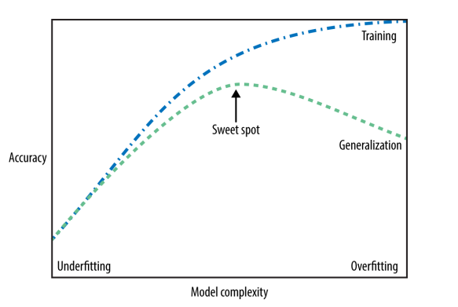
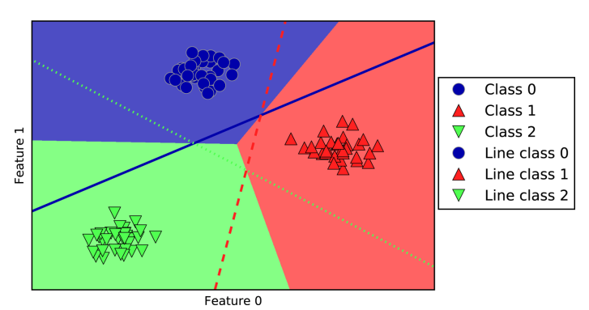
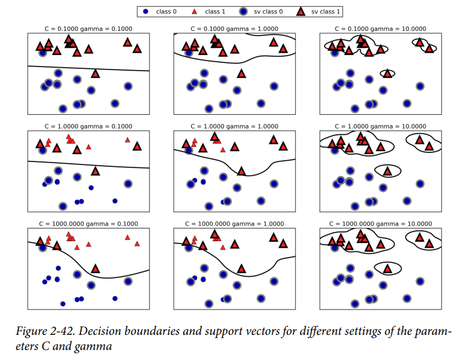

# Introduction to Machine Learning with Python   Andreas Müller, Sarah Guido

* Bu kitap algoritmaların matematiksel açıklamasından ziyade uygulamalarına odaklanmıştır. Matematiksel açıklamalarıyla ilgilenenler için The Elements of Statistical Learning kitabı önerilmektedir.

# Introduction

* Makine öğrenmesi süreçlerindeki en önemli adım muhtemelen elimizdeki verileri anlamaktır.

* pandas ile pair plot çizdirmenin kolay yolu 
    > pd.plotting.scatter_matrix 

* Scikit learn modellerinin bir çok parametresi vardır ancak bunların çoğu hız optimizasyonu veya çok özel durumlar içindir.

# Supervised Learning
  
* Eğer bir model hiç görmediği verilere karşı da iyi performans gösteriyorsa model genelleştirilebilirdir(generalizable).
* model karmaşıklığı arttıkça başarım bir yere kadar artar ancak sonra düşmeye başlar.

    

* Bir modele daha fazla veri eklendikçe overfitting ve verileri hatırlaması zorlaşır.
  
## KNN

* KNN'de 2 önemli hipermarametre vardır : 
    1. Komşu sayısı
    2. Uzaklık ölçüsü
* KNN kolay anlaşılabnilir bir modeldir ve çok fazla ayarlamaya ihtiyaç duymadan makul sonuçlar verebilir. Bu yüzden daha gelişmiş modeller kullanmadan önce knn'e bakılabilir.
* Genelde knn hızlı çalışır fakat training veri seti büyükse prediction biraz yavaş olabilir.
* KNN'i kullanmadan önce verinin işlenmesi önemlidir.
* Çok öznitelikli verisetlerinde performansı düşer. Özellikle seyrek verisetlerinde başarısız bir yaklaşımdır.

## Lineer Modeller
### Linear Regression
* En küçük kareler yöntemini kullanarak regression doğrsusu çizmeye yarar.
* Hiperparametresi yoktur. Bu yüzden modelin karmaşıklığını değiştiremeyiz. 
* Lineer modeller, regresyon uygulamalarında boyut arttıkça daha iyi başarım gösterirken overfitting olasılığı da artar

### Ridge Regression
* Ridge regresyon, lineer regresyonun L2 regularizasyon uygulanmış halidir.
* L2 regularizasyonda ağırlıkların mümkün olduğunca küçük tutulması amaçlanır. Yani her bir ağırlığın sonuca etkisi minimum olmalıdır. Böylece eğim azalır ve overfitting önlenir.
* Regularizasyon parametresi : alpha
  * alpha, 0'a yaklaştıkça regularizasyon azalır.
  * alpha = 0 olduğu zaman lineer regresyonla aynı sonucu verir.

### Lasso Regression
* Lineer regresyoa L1 regularizasyon eklenmesidir.
* L1 regularizasyonun L2 regularizasyondan önemli bir farkı, en önemsiz özniteliklerin ağırlıklarını 0 yaparak o öznitelikleri iptal etmesidir.

### Elastic Net
* L1 ve L2 regularizasyonun birlikte kullanılmasıdır.
* Karışım oranı : r
  * r = 0 ise model ridge regresyona
  * r = 1 ise model lasso regresyona denktir.
  
* Feature selection gerekliyse Lasso veya ElasticNet gereksizse Ridge kullanılması uygundur.

### Classification için lineer modeller(Linear SVC ve Logistic Regression)
* Default olarak iki model de L2 Regularizasyonu kullanır. 
* Bu modellerde regularizasyon parametresi C'dir.
  * C default olarak 1'dir.
  * C değeri büyüdükçe regularizasyon azalır. Küçüldükçe artar.
  * Yani modelin genelleştiriciliğini artırmak için C değeri küçültülmelidir.

### Multiclass classification için lineer modeller
* Lineer modellerin çoğu ikili sınıflandırma içindir ve lojistik regresyon haricinde çoklu sınıflandırmayı doğal olarak kapsamaz. Bu yüzden lineer modelleri ikili sınıflandırmaya uyarlamak için one-vs-rest yaklaşımı kullanılır.
  
* One-vs-rest yaklaşımı : lineer model her bir sınıfı diğerlerinden ayırmak için eğitilir. Daha sonra her bir nokta için en yüksek skoru veren model o noktayı sınıflandırmak için kullanılır. Böylece 3 sınıf birbirinden ayrılmış olur. 
Arada kalan alanlar en yakın doğruya göre sınıflandırılır.

### Strengths, weaknesses, and parameters
The main parameter of linear models is the regularization parameter, called alpha in the regression models and C in LinearSVC and LogisticRegression. Large values for alpha or small values for C mean simple models. In particular for the regression models, tuning these parameters is quite important. Usually C and alpha are searched for on a logarithmic scale. The other decision you have to make is whether you want to use L1 regularization or L2 regularization. If you assume that only a few of your features are actually important, you should use L1. Otherwise, you should default to L2. L1 can also be useful if interpretability of the model is important. As L1 will use only a few features, it is easier to explain which features are important to the model, and what the effects of these features are. 

Linear models are very fast to train, and also fast to predict. They scale to very large datasets and work well with sparse data. If your data consists of hundreds of thousands or millions of samples, you might want to investigate using the solver='sag' option in LogisticRegression and Ridge, which can be faster than the default on large datasets. Other options are the SGDClassifier class and the SGDRegressor class, which implement even more scalable versions of the linear models described here. 

Another strength of linear models is that they make it relatively easy to understand how a prediction is made, using the formulas we saw earlier for regression and classification. Unfortunately, it is often not entirely clear why coefficients are the way they are. This is particularly true if your dataset has highly correlated features; in these cases, the coefficients might be hard to interpret.

Linear models often perform well when the number of features is large compared to the number of samples. They are also often used on very large datasets, simply because it’s not feasible to train other models. However, in lower-dimensional spaces, other models might yield better generalization performance.

## Naive Nayes Sınıflandırıcılar
* Naive Bayes sınıflandırıcılar lineer modellere benzer ancak eğitimde onlardan biraz daha hızlıdırlar. Bununla beraber lineer modellerden biraz daha kötü bir genelleştirme performansı gösterirler.

### Strengths, weaknesses, and parameters
MultinomialNB and BernoulliNB have a single parameter, alpha, which controls model complexity. The way alpha works is that the algorithm adds to the data alpha many virtual data points that have positive values for all the features. This results in a “smoothing” of the statistics. A large alpha means more smoothing, resulting in less complex models. The algorithm’s performance is relatively robust to the setting of alpha, meaning that setting alpha is not critical for good performance. However, tuning it usually improves accuracy somewhat. 

GaussianNB is mostly used on very high-dimensional data, while the other two variants of naive Bayes are widely used for sparse count data such as text. MultinomialNB usually performs better than BernoulliNB, particularly on datasets with a relatively large number of nonzero features (i.e., large documents).

The naive Bayes models share many of the strengths and weaknesses of the linear models. They are very fast to train and to predict, and the training procedure is easy to understand. The models work very well with high-dimensional sparse data and are relatively robust to the parameters. Naive Bayes models are great baseline models and are often used on very large datasets, where training even a linear model might take too long.

## Decision Trees
* Karar ağaçlarında overfitting'i önlemek için 2 temel yöntem vardır: 
    1. Pre-Pruning
    2. Post-Pruning(ya da sadece pruning)
* Pre-pruning : maksimum derinliği sınırlama, maksimum yaprakları sınırlama veya her bir düğümdeki minimum nokta sayısını sınırlama.
* Scikit-learn'deki decision tree sınflandırıcısı sadece pre-pruning destekler. Post-pruning desteklemez.
* decision tree sınıflandırıcısının feature_importance_ listesinde bir feature'ın yüksek puanlı çıkması her zaman o feature'ın yüksek bilgi içermesi anlamına gelmez. Sadece o karar ağacının o feature'ı kullandığı ve iyi çalıştığını gösterir.

### Strengths, weaknesses, and parameters
As discussed earlier, the parameters that control model complexity in decision trees are the pre-pruning parameters that stop the building of the tree before it is fully developed. Usually, picking one of the pre-pruning strategies—setting either max_depth, max_leaf_nodes, or min_samples_leaf—is sufficient to prevent overfitting. 

Decision trees have two advantages over many of the algorithms we’ve discussed so far: the resulting model can easily be visualized and understood by nonexperts (at least for smaller trees), and the algorithms are completely invariant to scaling of the data. As each feature is processed separately, and the possible splits of the data don’t  depend on scaling, no preprocessing like normalization or standardization of features is needed for decision tree algorithms. In particular, decision trees work well when you have features that are on completely different scales, or a mix of binary and continuous features. The main downside of decision trees is that even with the use of pre-pruning, they tend to overfit and provide poor generalization performance. Therefore, in most applications, the ensemble methods we discuss next are usually used in place of a single decision tree.

## Random Forest

### Building random forests

To build a random forest model, you need to decide on the number of trees to build (the n_estimators parameter of RandomForestRegressor or RandomForestClassifier). Let’s say we want to build 10 trees. These trees will be built completely independently from each other, and the algorithm will make different random choices for each tree to make sure the trees are distinct. To build a tree, we first take what is called a bootstrap sample of our data. That is, from our n_samples data points, we repeatedly draw an example randomly with replacement (meaning the same sample can be picked multiple times), n_samples times. This will create a dataset that is as big as the original dataset, but some data points will be missing from it (approximately one third), and some will be repeated. 

To illustrate, let’s say we want to create a bootstrap sample of the list ['a', 'b','c', 'd']. A possible bootstrap sample would be ['b', 'd', 'd', 'c']. Another possible sample would be ['d', 'a', 'd', 'a'].

Next, a decision tree is built based on this newly created dataset. However, the algorithm we described for the decision tree is slightly modified. Instead of looking for the best test for each node, in each node the algorithm randomly selects a subset of the features, and it looks for the best possible test involving one of these features.The number of features that are selected is controlled by the max_features parameter. This selection of a subset of features is repeated separately in each node, so that each node in a tree can make a decision using a different subset of the features.

The bootstrap sampling leads to each decision tree in the random forest being built on a slightly different dataset. Because of the selection of features in each node, each split in each tree operates on a different subset of features. Together, these two mechanisms ensure that all the trees in the random forest are different.

A critical parameter in this process is max_features. If we set max_features to n_features, that means that each split can look at all features in the dataset, and no randomness will be injected in the feature selection (the randomness due to the bootstrapping remains, though). If we set max_features to 1, that means that the splits have no choice at all on which feature to test, and can only search over different thresholds for the feature that was selected randomly. Therefore, a high max_features means that the trees in the random forest will be quite similar, and they will be able to fit the data easily, using the most distinctive features. A low max_features means that the trees in the random forest will be quite different, and that each tree might need to be very deep in order to fit the data well. 

To make a prediction using the random forest, the algorithm first makes a prediction for every tree in the forest. For regression, we can average these results to get our final prediction. For classification, a “soft voting” strategy is used. This means each algorithm makes a “soft” prediction, providing a probability for each possible output label. The robabilities predicted by all the trees are averaged, and the class with the highest probability is predicted.

* Typically, the feature importances provided by the random forest are more reliable than the ones provided by a single tree.

### Strengths, weaknesses, and parameters
 Random forests for regression and classification are currently among the most widely used machine learning methods. They are 
very powerful, often work well without heavy tuning of the parameters, and don’t require scaling of the data. 

Essentially, random forests share all of the benefits of decision trees, while making up for some of their deficiencies. One reason to still use decision trees is if you need a compact representation of the decision-making process. It is basically impossible to interpret tens or hundreds of trees in detail, and trees in random forests tend to be deeper than decision trees (because of the use of feature subsets). Therefore, if you need to summarize the prediction making in a visual way to nonexperts, a single decision tree might be a better choice. While building random forests on large datasets might be somewhat time consuming, it can be parallelized across multiple CPU cores within a computer easily. If you are using a multi-core processor (as nearly all modern computers do), you can use the n_jobs parameter to adjust the number of cores to use. Using more CPU cores will result in linear speed-ups (using two cores, the training of the random forest will be twice as fast), but specifying n_jobs larger than the number of cores will not help. You can set n_jobs=-1 to use all the cores in your computer. 

You should keep in mind that random forests, by their nature, are random, and setting different random states (or not setting the random_state at all) can drastically change the model that is built. The more trees there are in the forest, the more robust it will be against the choice of random state. If you want to have reproducible results, it is important to fix the random_state. 

Random forests don’t tend to perform well on very high dimensional, sparse data, such as text data. For this kind of data, linear models might be more appropriate. Random forests usually work well even on very large datasets, and training can easily be parallelized over many CPU cores within a powerful computer. However, random forests require more memory and are slower to train and to predict than linear models. If time and memory are important in an application, it might make sense to use a linear model instead. 

The important parameters to adjust are n_estimators, max_features, and possibly pre-pruning options like max_depth. For n_estimators, larger is always better. Averaging more trees will yield a more robust ensemble by reducing overfitting. However, there are diminishing returns, and more trees need more memory and more time to train. A common rule of thumb is to build “as many as you have time/memory for.” 

As described earlier, max_features determines how random each tree is, and a smaller max_features reduces overfitting. In general, it’s a good rule of thumb to use the default values: max_features=sqrt(n_features) for classification and max_features=n_features for regression. Adding max_features or max_leaf_nodes might sometimes improve performance. It can also drastically reduce space and time requirements for training and prediction.

## Gradient Boost

Gradient boosted regression trees (gradient boosting machines) The gradient boosted regression tree is another ensemble method that combines multiple decision trees to create a more powerful model. Despite the “regression” in the name, these models can be used for regression and classification. In contrast to the random forest approach, gradient boosting works by building trees in a serial manner, where each tree tries to correct the mistakes of the previous one. By default, there is no randomization in gradient boosted regression trees; instead, strong pre-pruning is used. Gradient boosted trees often use very shallow trees, of depth one to five, which makes the model smaller in terms of memory and makes predictions faster.

The main idea behind gradient boosting is to combine many simple models (in this context known as weak learners), like shallow trees. Each tree can only provide good predictions on part of the data, and so more and more trees are added to iteratively improve performance.

Gradient boosted trees are frequently the winning entries in machine learning competitions, and are widely used in industry. They are generally a bit more sensitive to parameter settings than random forests, but can provide better accuracy if the parameters are set correctly.

Apart from the pre-pruning and the number of trees in the ensemble, another important parameter of gradient boosting is the learning_rate, which controls how strongly each tree tries to correct the mistakes of the previous trees. A higher learning rate means each tree can make stronger corrections, allowing for more complex models. Adding more trees to the ensemble, which can be accomplished by increasing n_estimators, also increases the model complexity, as the model has more chances to correct mistakes on the training set.

### Strengths, weaknesses, and parameters
Gradient boosted decision trees are among the most powerful and widely used models for supervised learning. Their main drawback is that they require careful tuning of the parameters and may take a long time to train. Similarly to other tree-based models, the algorithm works well without scaling and on a mixture of binary and continuous features. As with other tree-based models, it also often does not work well on high-dimensional sparse data. The main parameters of gradient boosted tree models are the number of trees, n_estimators, and the learning_rate, which controls the degree to which each tree is allowed to correct the mistakes of the previous trees. These two parameters are highly interconnected, as a lower learning_rate means that more trees are needed to build a model of similar complexity. In contrast to random forests, where a higher n_estimators value is always better, increasing n_estimators in gradient boosting leads to a more complex model, which may lead to overfitting. A common practice is to fit n_estimators depending on the time and memory budget, and then search over dif‐
ferent learning_rates.

Another important parameter is max_depth (or alternatively max_leaf_nodes), to reduce the complexity of each tree. Usually max_depth is set very low for gradient boosted models, often not deeper than five splits.

## SVM

### Tuning SVM parameters
The gamma parameter is the one shown in the formula given in the previous section, which corresponds to the inverse of the width of the Gaussian kernel. Intuitively, the gamma parameter determines how far the influence of a single training example reaches, with low values meaning corresponding to a far reach, and high values to a limited reach. In other words, the wider the radius of the Gaussian kernel, the further the influence of each training example. The C parameter is a regularization parameter, similar to that used in the linear models. It limits the importance of each point (or more precisely, their dual_coef_)

Going from left to right, we increase the value of the parameter gamma from 0.1 to 10. A small gamma means a large radius for the Gaussian kernel, which means that many points are considered close by. This is reflected in very smooth decision boundaries on the left, and boundaries that focus more on single points further to the right. A low value of gamma means that the decision boundary will vary slowly, which yields a model of low complexity, while a high value of gamma yields a more complex model. 

Going from top to bottom, we increase the C parameter from 0.1 to 1000. As with the linear models, a small C means a very restricted model, where each data point can only have very limited influence. You can see that at the top left the decision boundary looks nearly linear, with the misclassified points barely having any influence on the line. Increasing C, as shown on the bottom left, allows these points to have a
stronger influence on the model and makes the decision boundary bend to correctly classify them.

### Strengths, weaknesses, and parameters
Kernelized support vector machines are powerful models and perform well on a variety of datasets. SVMs allow for complex decision boundaries, even if the data has only a few features. They work well on low-dimensional and high-dimensional data (i.e., few and many features), but don’t scale very well with the number of samples. Running an SVM on data with up to 10,000 samples might work well, but working with datasets of size 100,000 or more can become challenging in terms of runtime and memory usage.

Another downside of SVMs is that they require careful preprocessing of the data and tuning of the parameters. This is why, these days, most people instead use tree-based models such as random forests or gradient boosting (which require little or no pre‐processing) in many applications. Furthermore, SVM models are hard to inspect; it can be difficult to understand why a particular prediction was made, and it might be tricky to explain the model to a nonexpert.

Still, it might be worth trying SVMs, particularly if all of your features represent measurements in similar units (e.g., all are pixel intensities) and they are on similar scales.

The important parameters in kernel SVMs are the regularization parameter C, the choice of the kernel, and the kernel-specific parameters. Although we primarily focused on the RBF kernel, other choices are available in scikit-learn. The RBF kernel has only one parameter, gamma, which is the inverse of the width of the Gaussian kernel. gamma and C both control the complexity of the model, with large values in either resulting in a more complex model. Therefore, good settings for the two parameters are usually strongly correlated, and C and gamma should be adjusted together.

## Neural Networks
* Yapay sinir ağlarının bi çok çeşidi vardır. Bu kitapta yapay sinir ağlarına bir giriş kabul edilen multilayer perceptrons işlenecektir.
* MLP aynı zamanda Vanilla Neural Networks olarak da bilinir.
* Neural networks also expect all input features to vary in a similar way, and ideally to have a mean of 0, and a variance of 1. 
* ` Stochastic Optimizer: Maximum iterations reached and the optimization hasn't converged yet. ` hatasıyla karşılaşılırsa max_iter parametresi artırılmalıdır.

### Strengths, weaknesses, and parameters
Neural networks have reemerged as state-of-the-art models in many applications of machine learning. One of their main advantages is that they are able to capture information contained in large amounts of data and build incredibly complex models. Given enough computation time, data, and careful tuning of the parameters, neural networks often beat other machine learning algorithms (for classification and regression tasks).
This brings us to the downsides. Neural networks—particularly the large and powerful ones—often take a long time to train. They also require careful preprocessing of the data, as we saw here. Similarly to SVMs, they work best with “homogeneous” data, where all the features have similar meanings. For data that has very different kinds of features, tree-based models might work better. Tuning neural network parameters is also an art unto itself. In our experiments, we barely scratched the surface of possible ways to adjust neural network models and how to train them.

### Estimating complexity in neural networks
The most important parameters are the number of layers and the number of hidden units per layer. You should start with one or two hidden layers, and possibly expand from there. The number of nodes per hidden layer is often similar to the number of input features, but rarely higher than in the low to mid-thousands. A helpful measure when thinking about the model complexity of a neural network is the number of weights or coefficients that are learned. If you have a binary classification dataset with 100 features, and you have 100 hidden units, then there are 100 * 100 = 10,000 weights between the input and the first hidden layer. There are also 100 * 1 = 100 weights between the hidden layer and the output layer, for a total of around 10,100 weights. If you add a second hidden layer with 100 hidden units, there will be another 100 * 100 = 10,000 weights from the first hidden layer to the second hidden layer, resulting in a total of 20,100 weights. If instead you use one layer with 1,000 hidden units, you are learning 100 * 1,000 = 100,000 weights from the input to the hidden layer and 1,000 * 1 weights from the hidden layer to the output layer, for a total of 101,000. If you add a second hidden layer you add 1,000 * 1,000 = 1,000,000 weights, for a whopping total of 1,101,000—50 times larger than the model with two hidden layers of size 100. A common way to adjust parameters in a neural network is to first create a network that is large enough to overfit, making sure that the task can actually be learned by the network. Then, once you know the training data can be learned, either shrink the network or increase alpha to add regularization, which will improve generalization performance. In our experiments, we focused mostly on the definition of the model: the number of layers and nodes per layer, the regularization, and the nonlinearity. These define the model we want to learn. There is also the question of how to learn the model, or the algorithm that is used for learning the parameters, which is set using the algorithm parameter. There are two easy-to-use choices for algorithm. The default is 'adam', which works well in most situations but is quite sensitive to the scaling of the data (so it is important to always scale your data to 0 mean and unit variance). The other one is 'lbfgs', which is quite robust but might take a long time on larger models or larger datasets. There is also the more advanced 'sgd' option, which is what many deep learning researchers use. The 'sgd' option comes with many additional parameters that need to be tuned for best results. You can find all of these parameters and their definitions in the user guide. When starting to work with MLPs, we recommend sticking to 'adam' and 'lbfgs'.

# Model Evaluation and Improvement
## Cross Validation
### K-Fold Cross Validation
Cross validation(Çapraz doğrulama), genelleştirme performansını ölçmek için kullanılan bir yöntemdir. Bu yöntemde veriseti k kez farklı parçalara bölünür. Her birinde model farklı eğitim ve test verisetinde çalıştırılır. Cross validation scikit-learn'de cross_val_score metoduyla uygulanmıştır. Bu metod parametre olarak uygulanacak model, bağımsız değişken, bağımlı değişken ve çapraz geçerleme sayısını alır. Çapraz geçerleme puanlarını içeren bir list geriye döndürür. Cross validation uygulamanın bir kez eğitim ve test verisini bölmeye göre avantajları vardır. Mesela eğitim ve test verisini bir kez böldüğümüzde verinin bir kısmına göre sonuç verir. Cross validation'da tüm verinin ortalamasını verir. Böylece modelin verinin tamamını sınıflandırmadaki başarısını daha net gözlemleyebiliriz. Ancak cross validaton'ın ana dezavantajı hesaplama maliyetidir. cross_val_score fonksiyonu model inşa etmede kullanılmaz sadece modeli değerlendirmede kullanılır.

### Stratified K-Fold Cross Validation
Bu yöntemde veriseti, sınıf oranları korunacak şekilde bölünür. Örneğin verisetinde 90 tane 0 sınıfı, 10 tane 1 sınıfı olduğunu düşünürsek stratified 10-fold cross validation'da her bir bölmede 9 tane 0 sınıfı, 1 tane 1 sınıfı bulunur.

### Shuffle Split Cross Validation
Bu yöntemde veri seti rastgele parçalara bölünür ancak bazı parçalar kullanılmaz. Bazı parçalar bir kaç kez kullanılır.

### Grid Search
Grid search yönteminde modelin hiperparametrelerini ayarlamak için tüm hiperparametre kombinasyonları tek tek denenir ve en iyi sonuç verenler belirlenir. Grid search genelde cross validation ile birlikte kullanılır. Ama burada dikkat edilmesi gereken nokta test verisini ayrıca değerlendirip grid search'e karıştırmamaktır. Bu durumda model test verisine göre fit edilmiş olur. Buna veri sızıntısı(data leakage) denir.

### Nested Cross Validation
Grid search ile n-fold cross validation kullanılarak en iyi parametreler arandığında modelin hatası aynı veriseti üzerinde ölçüldüğü için overfitting durumu gözlemlenebilmektedir. Bu yüzden parametreleri ararken iç içe iki farklı döngü kullanılmaktadır. Buna nested cross validation denmektedir. Dışdaki döngü sadece içteki döngü için verisetini bölmekle görevlidir. İçteki döngü ise esas hiperparametre aramasının yapıldığı kısımdır. Nested cross validation'ı kullanmak için açık kaynak bir paket de mevcuttur : https://github.com/casperbh96/Nested-Cross-Validation
> pip install nested-cv

## Evaluation Metrics and Scoring

### Hata çeşitleri(Kinds of Errors)
Genellikle accuracy modelin hatasıyla ilgili tüm bilgiyi içermediği için çok iyi bir ölçüt değildir. Kanseri erken teşhis eden bir sistemi düşünelim. Test negatif çıkarsa hasta sağlıklı sayılacak ve test pozitif çıkarsa hasta başka araştırmalardan geçecek. Modelin her zaman mükemmel çalışacağını bekleyemeyiz, mutlaka hatalarla karşılaşılacaktır. Burada sorulması gereken soru "bu hataların gerçek hayattaki sonuçları neler olabilir?"

Olası bir hata, sağlıklı bir bireyin pozitif olarak sınıflandırılmasıdır. Bu durumda birey için zahmet ve sıkıntı çekmesine neden olacaktır. Hatalı pozitif sınıflandırmalara false positive denir. Diğer olası hata da hasta bir bireyin sağlıklı olarak sınıflandırılmasıdır ki bunun ciddi sağlıksal sonuçları olabilir. Ayrıca istatistikte false negative, type-1 error; false positive, type-2 error olarak da adlandırılır. Kanser teşhis örneğinde false negatif hatasının olabildiğince az olması hedeflenir.